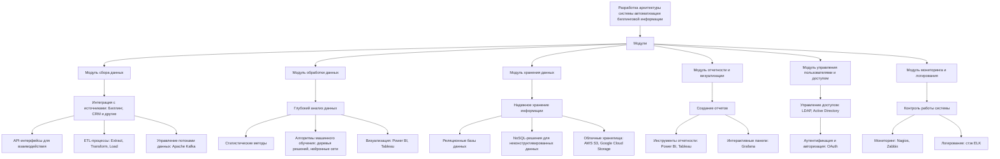

# Knowledge-base
Для ведения базы я использую Obsidian.

```mermaid
graph TD  
    A[Разработка архитектуры системы автоматизации биллинговой информации]  
    
    B[Модули]  
    A --> B  

    B1[Модуль сбора данных]  
    B2[Модуль обработки данных]  
    B3[Модуль хранения данных]  
    B4[Модуль отчетности и визуализации]  
    B5[Модуль управления пользователями и доступом]  
    B6[Модуль мониторинга и логирования]  
    
    B --> B1  
    B --> B2  
    B --> B3  
    B --> B4  
    B --> B5  
    B --> B6  

    %% Модуль сбора данных  
    B1 --> C1[Интеграция с источниками: Биллинг, CRM и другие]  
    C1 --> C2[API-интерфейсы для взаимодействия]  
    C1 --> C3[ETL-процессы: Extract, Transform, Load]  
    C1 --> C4[Управление потоками данных: Apache Kafka]  

    %% Модуль обработки данных  
    B2 --> D1[Глубокий анализ данных]  
    D1 --> D2[Статистические методы]  
    D1 --> D3[Алгоритмы машинного обучения: деревья решений, нейронные сети]  
    D1 --> D4[Визуализация: Power BI, Tableau]  

    %% Модуль хранения данных  
    B3 --> E1[Надежное хранение информации]  
    E1 --> E2[Реляционные базы данных]  
    E1 --> E3[NoSQL-решения для неконструктивированных данных]  
    E1 --> E4[Облачные хранилища: AWS S3, Google Cloud Storage]  

    %% Модуль отчетности и визуализации  
    B4 --> F1[Создание отчетов]  
    F1 --> F2[Инструменты отчетности: Power BI, Tableau]  
    F1 --> F3[Интерактивные панели: Grafana]  

    %% Модуль управления пользователями и доступом  
    B5 --> G1[Управление доступом: LDAP, Active Directory]  
    G1 --> G2[Аутентификация и авторизация: OAuth]  

    %% Модуль мониторинга и логирования  
    B6 --> H1[Контроль работы системы]  
    H1 --> H2[Мониторинг: Nagios, Zabbix]  
    H1 --> H3[Логирование: стэк ELK]
```

